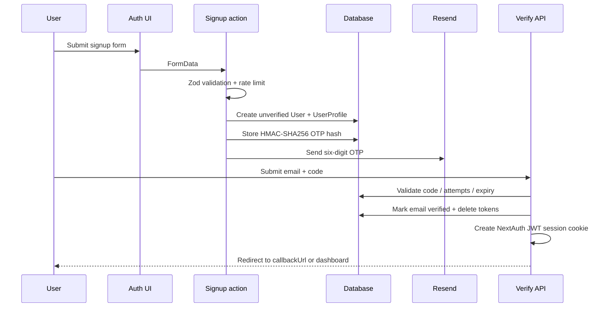
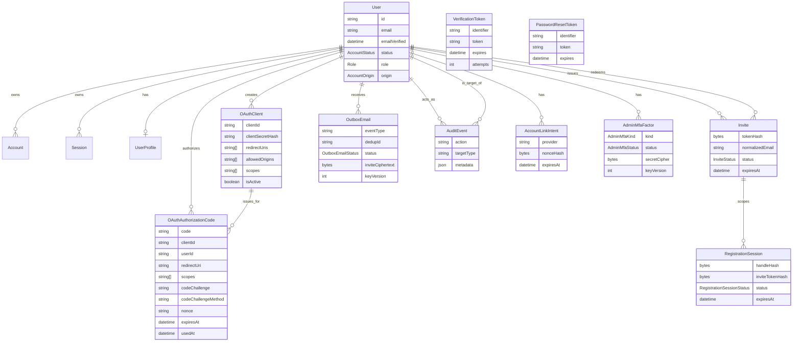
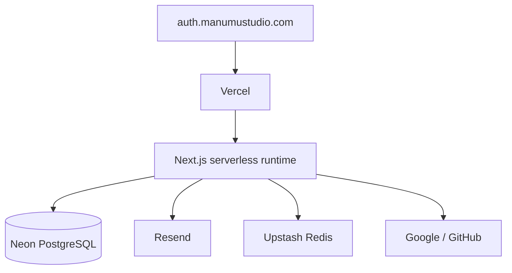

# Architecture

**Version:** 1.9.0
**Last Updated:** 2026-06-21

## System Role

ManuMu Authentication is a central identity provider for ManuMu Studio
applications. It combines:

- first-party credentials and social sign-in;
- account/profile management;
- an OAuth 2.0 Authorization Code server;
- OIDC discovery, ID tokens, UserInfo, JWKS, and logout.

The service is deployed as a Next.js App Router application on Vercel, with
Prisma and PostgreSQL/Neon for persistence.

```mermaid
flowchart LR
    RP[Relying-party app] -->|authorize redirect| AUTH[ManuMu Auth]
    AUTH --> NA[NextAuth session]
    AUTH --> DB[(PostgreSQL)]
    AUTH --> EMAIL[Resend]
    AUTH --> SOCIAL[Google / GitHub]
    AUTH -->|authorization code| RP
    RP -->|code + client auth / PKCE| TOKEN[/oauth/token]
    TOKEN -->|RS256 access + ID tokens| RP
    RP --> JWKS[/jwks.json]
    RP --> INFO[/oauth/userinfo]
```

## Runtime Layers

| Layer | Location | Responsibility |
|-------|----------|----------------|
| App Router | `src/app/` | Pages, route handlers, layouts |
| Authentication domain | `src/features/auth/` | Auth UI, actions, verification, reset, OAuth/OIDC, social sign-in gates, invite lifecycle services, admission helpers |
| Account domain | `src/features/account/` | Profile, onboarding, password, providers, deletion |
| Shared UI | `src/components/ui/` | Reusable application components |
| Shared runtime | `src/lib/` | Prisma, environment, rate limiting, validation, data |
| Persistence | `prisma/` | Schema, migrations, seed, gated-registration foundation models |

Route handlers generally delegate to feature/server modules. A known exception
is OTP verification, which performs the post-verification user lookup and
session creation in the route.

## Authentication Flows

### Credentials Signup and OTP Verification



Current behavior:

- OTPs use `crypto.randomInt`.
- OTP codes are stored as HMAC-SHA256 keyed with `OTP_HMAC_SECRET`; a bare-SHA-256 hash is not recoverable without the server secret.
- Maximum attempts are enforced, but failed-attempt updates are not fully
  atomic.
- Successful verification automatically creates a 30-day JWT session.
- Self-service signup is disabled in production via `SELF_SERVICE_REGISTRATION_ENABLED=false`; the gated-registration schema, invite lifecycle service, transactional outbox worker, and shared admission-control foundation exist, while the user-facing invite runtime flow remains the planned next state.

### Credentials Sign-In

1. NextAuth Credentials provider Zod-validates email/password.
2. The request is rate-limited by IP and normalized email.
3. Prisma loads the user.
4. PETSGRAM-origin accounts are rejected from first-party credentials login.
5. bcrypt compares the password.
6. Unverified accounts are rejected.
7. NextAuth issues a JWT session containing user ID and role.

### Social Sign-In

Google and GitHub providers are enabled only when both provider environment
variables exist. Social callbacks are gated by provider account identity, not by
email equality:

1. Non-OAuth sign-in follows the credentials flow.
2. OAuth sign-in looks up the exact `{ provider, providerAccountId }` account.
3. The callback allows the sign-in only when that account already exists and the
   linked user is `ACTIVE`.
4. Unlinked OAuth identities, same-email credentials users without an existing
   social `Account`, and inactive/suspended/deleted users are denied generically.

The Prisma adapter is wrapped so `createUser` and `linkAccount` throw before
durable persistence if a future NextAuth path bypasses the callback gate.
Explicit social account linking is reserved for a future both-factor ceremony.

### Password Reset

1. A server action validates and rate-limits the request.
2. Unknown and OAuth-only accounts receive the same success response.
3. A random 256-bit token is stored in `PasswordResetToken`.
4. Resend delivers a URL containing the token.
5. Token consumption updates the password, deletes reset tokens, and deletes
   database sessions in one transaction.

The token is currently stored directly rather than hashed; hardening is
planned.

## OAuth/OIDC Flow

### Authorization

`src/app/oauth/authorize/page.tsx`:

- reads browser authorization parameters;
- requires an authenticated NextAuth session;
- calls `validateAuthorizeRequest`;
- displays consent;
- creates a short-lived authorization code;
- redirects to the exact registered redirect URI with `code` and `state`.

Validation includes client status, exact redirect URI matching, supported and
client-allowed scopes, response type, mandatory S256 PKCE fields, and optional nonce.

### Token Exchange

`POST /oauth/token` accepts form or JSON input and supports
`authorization_code` only.

The exchange:

- binds the code to `client_id`;
- verifies a confidential client secret or the stored PKCE challenge;
- checks redirect URI, expiry, and `usedAt`;
- marks the code used;
- issues a one-hour RS256 access token;
- issues an ID token when `openid` was granted.

**1.8.5 security properties:**
- PKCE S256 is mandatory; `plain` is rejected and missing challenges are rejected.
- Code consumption is atomic: a single conditional `updateMany` claims the code; tokens are issued only when exactly one row is claimed.
- The token endpoint is rate-limited by independent per-IP and per-client-id buckets.
- Token request bodies are Zod-validated.
- All token responses carry `Cache-Control: no-store` and `Pragma: no-cache`. Rate-limit 429 responses include `Retry-After`.

### Claims and Subjects

Access tokens contain:

- `iss`
- `aud`
- `sub`
- `iat`
- `exp`
- `scope`

The current `sub` is the canonical `User.id`, so it is public and correlatable
across clients. Existing relying parties depend on this behavior. Pairwise
subjects are planned for new clients only.

Email and profile claims are returned only when their scopes are granted.

### Discovery and Verification

- `/.well-known/openid-configuration`
- `/jwks.json`
- `/oauth/userinfo`
- `/oauth/logout`

JWKS publishes a single RS256 public key with a derived or configured `kid`.
Key rotation is not automated. Discovery advertises `code_challenge_methods_supported: ["S256"]` only.

### RP-Initiated Logout

`/oauth/logout`:

- accepts `client_id` or a signature-verified `id_token_hint`;
- validates `post_logout_redirect_uri` against `redirectUris`;
- clears secure and non-secure NextAuth cookie names;
- returns a redirect with optional `state`.

Expired ID token hints are accepted after signature verification. Maximum-age
hardening is pending.

### Rate Limiting

A 7-entry immutable policy map assigns independent rate-limit ceilings to each abuse surface:

- credentials sign-in (per IP + email)
- signup (per IP)
- OTP verification (per IP + email)
- OTP resend (per IP + email)
- password-reset request (per IP)
- OAuth token exchange — two independent buckets: per-IP (checked before body parsing) and per-normalized-client-id (checked after)
- OAuth UserInfo — two independent buckets: per-IP and per-SHA-256-token-fingerprint

Client secrets and raw bearer tokens never enter limiter keys or logs. The limiter is backed by Upstash Redis in production; a process-local fallback is available in development only.

## Data Model



`VerificationToken` and `PasswordResetToken` are keyed by normalized email
identifier but do not have Prisma relations to `User`.

## Deployment



Upstash Redis is required in production. The app refuses to start without valid Upstash credentials. The in-memory rate-limit fallback is available in development and test only. Independent admission dimensions are wired across seven surfaces: registration, invite-redemption, login, password-reset, OTP-verify, fragment-exchange, and admin-operation. The internal outbox worker endpoint consumes the same trusted-IP/rate-limit helpers and processes QStash-safe messages that contain only the opaque outbox row id plus non-secret routing metadata.

See [Deployment](DEPLOYMENT.md).

## Current Direction

1. Deploy security hardening (v1.8.5) to production and verify golden paths (CI passes; production verification pending).
2. Complete the invite-gated registration runtime on top of the gated-registration schema, invite lifecycle service, outbox worker, and admission-control foundation.
3. Reach the LSA engineering baseline for strict TypeScript, CI, tests,
   observability, documentation, and accessibility.
4. Add `App`, `AppMembership`, and `AppSubject`.
5. Keep existing clients on public subjects and default new clients to
   pairwise subjects.
6. Publish a thin redirect-based SDK after the server contract stabilizes.
