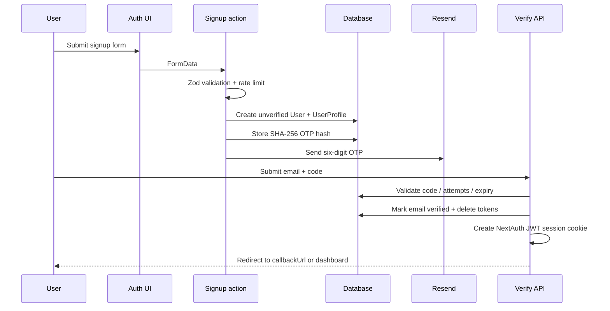
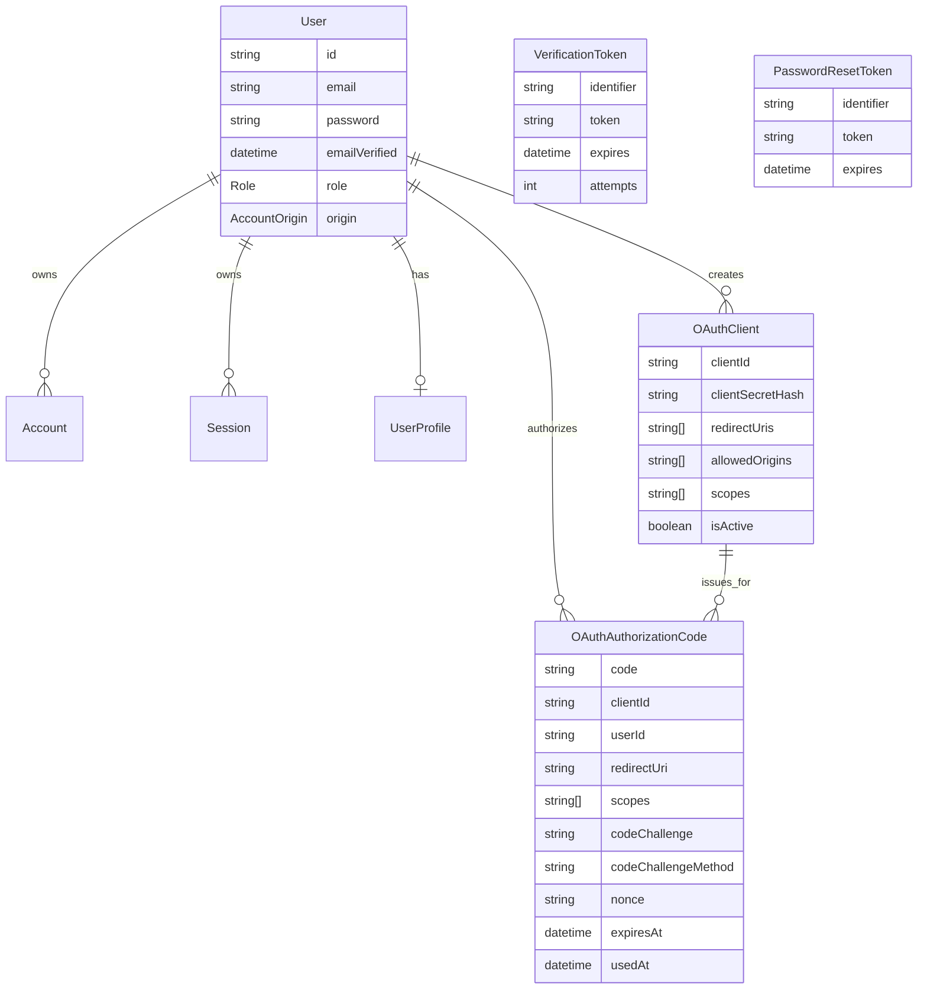
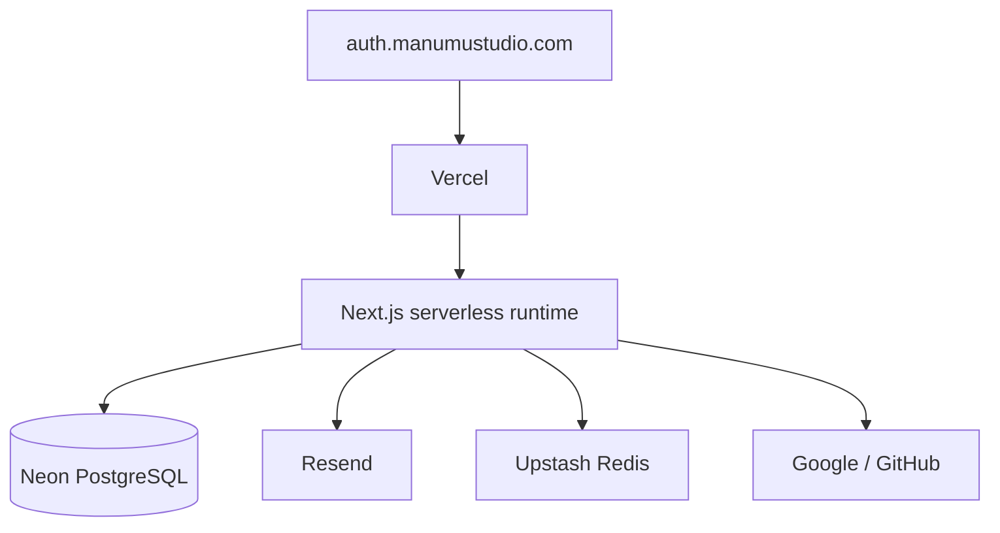

# Architecture

**Version:** 1.8.4
**Last Updated:** 2026-06-19

## System Role

ManuMu Authentication is a central identity provider for ManuMu Studio
applications. It combines:

- first-party credentials and social sign-in;
- account/profile management;
- an OAuth 2.0 Authorization Code server;
- OIDC discovery, ID tokens, UserInfo, JWKS, and logout.

The service is deployed as a Next.js App Router application on Vercel, with
Prisma and PostgreSQL/Neon for persistence.

```mermaid
flowchart LR
    RP[Relying-party app] -->|authorize redirect| AUTH[ManuMu Auth]
    AUTH --> NA[NextAuth session]
    AUTH --> DB[(PostgreSQL)]
    AUTH --> EMAIL[Resend]
    AUTH --> SOCIAL[Google / GitHub]
    AUTH -->|authorization code| RP
    RP -->|code + client auth / PKCE| TOKEN[/oauth/token]
    TOKEN -->|RS256 access + ID tokens| RP
    RP --> JWKS[/jwks.json]
    RP --> INFO[/oauth/userinfo]
```

## Runtime Layers

| Layer | Location | Responsibility |
|-------|----------|----------------|
| App Router | `src/app/` | Pages, route handlers, layouts |
| Authentication domain | `src/features/auth/` | Auth UI, actions, verification, reset, OAuth/OIDC |
| Account domain | `src/features/account/` | Profile, onboarding, password, providers, deletion |
| Shared UI | `src/components/ui/` | Reusable application components |
| Shared runtime | `src/lib/` | Prisma, environment, rate limiting, validation, data |
| Persistence | `prisma/` | Schema, migrations, seed |

Route handlers generally delegate to feature/server modules. A known exception
is OTP verification, which performs the post-verification user lookup and
session creation in the route.

## Authentication Flows

### Credentials Signup and OTP Verification



Current behavior:

- OTPs use `crypto.randomInt`.
- OTP hashes use bare SHA-256; HMAC hardening is pending.
- Maximum attempts are enforced, but failed-attempt updates are not fully
  atomic.
- Successful verification automatically creates a 30-day JWT session.
- Signup is currently public; invite gating is pending.

### Credentials Sign-In

1. NextAuth Credentials provider Zod-validates email/password.
2. The request is rate-limited by IP and normalized email.
3. Prisma loads the user.
4. PETSGRAM-origin accounts are rejected from first-party credentials login.
5. bcrypt compares the password.
6. Unverified accounts are rejected.
7. NextAuth issues a JWT session containing user ID and role.

### Social Sign-In

Google and GitHub providers are enabled only when both provider environment
variables exist. NextAuth's `allowDangerousEmailAccountLinking` option is
currently enabled. That is a documented hardening target, not a guarantee that
email-based linking is risk-free.

### Password Reset

1. A server action validates and rate-limits the request.
2. Unknown and OAuth-only accounts receive the same success response.
3. A random 256-bit token is stored in `PasswordResetToken`.
4. Resend delivers a URL containing the token.
5. Token consumption updates the password, deletes reset tokens, and deletes
   database sessions in one transaction.

The token is currently stored directly rather than hashed; hardening is
planned.

## OAuth/OIDC Flow

### Authorization

`src/app/oauth/authorize/page.tsx`:

- reads browser authorization parameters;
- requires an authenticated NextAuth session;
- calls `validateAuthorizeRequest`;
- displays consent;
- creates a short-lived authorization code;
- redirects to the exact registered redirect URI with `code` and `state`.

Validation includes client status, exact redirect URI matching, supported and
client-allowed scopes, response type, PKCE fields, and optional nonce.

### Token Exchange

`POST /oauth/token` accepts form or JSON input and supports
`authorization_code` only.

The exchange:

- binds the code to `client_id`;
- verifies a confidential client secret or the stored PKCE challenge;
- checks redirect URI, expiry, and `usedAt`;
- marks the code used;
- issues a one-hour RS256 access token;
- issues an ID token when `openid` was granted.

Known limitations:

- PKCE `plain` is accepted and PKCE is not mandatory for every client.
- Authorization-code consumption is read-then-update rather than atomic.
- The token endpoint is not rate-limited.
- Token request JSON is asserted rather than Zod-parsed.

### Claims and Subjects

Access tokens contain:

- `iss`
- `aud`
- `sub`
- `iat`
- `exp`
- `scope`

The current `sub` is the canonical `User.id`, so it is public and correlatable
across clients. Existing relying parties depend on this behavior. Pairwise
subjects are planned for new clients only.

Email and profile claims are returned only when their scopes are granted.

### Discovery and Verification

- `/.well-known/openid-configuration`
- `/jwks.json`
- `/oauth/userinfo`
- `/oauth/logout`

JWKS publishes a single RS256 public key with a derived or configured `kid`.
Key rotation is not automated.

### RP-Initiated Logout

`/oauth/logout`:

- accepts `client_id` or a signature-verified `id_token_hint`;
- validates `post_logout_redirect_uri` against `redirectUris`;
- clears secure and non-secure NextAuth cookie names;
- returns a redirect with optional `state`.

Expired ID token hints are accepted after signature verification. Maximum-age
hardening is pending.

## Data Model



`VerificationToken` and `PasswordResetToken` are keyed by normalized email
identifier but do not have Prisma relations to `User`.

## Deployment



Upstash is optional in the current environment schema. Without it, the app
falls back to process-local memory, which is unsuitable for production
serverless rate limiting. The hardening packet makes Upstash mandatory in
production.

See [Deployment](DEPLOYMENT.md).

## Current Direction

1. Resolve Incident P001 through security hardening.
2. Remove open signup through gated registration.
3. Reach the LSA engineering baseline for strict TypeScript, CI, tests,
   observability, documentation, and accessibility.
4. Add `App`, `AppMembership`, and `AppSubject`.
5. Keep existing clients on public subjects and default new clients to
   pairwise subjects.
6. Publish a thin redirect-based SDK after the server contract stabilizes.
